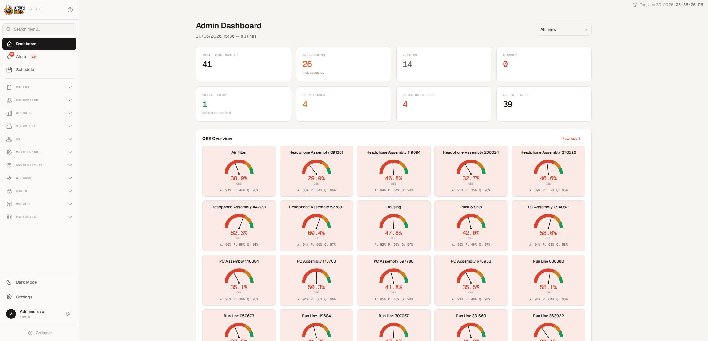
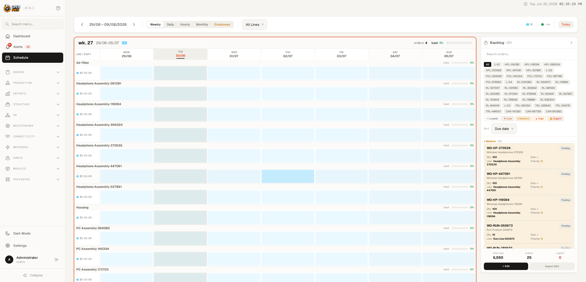
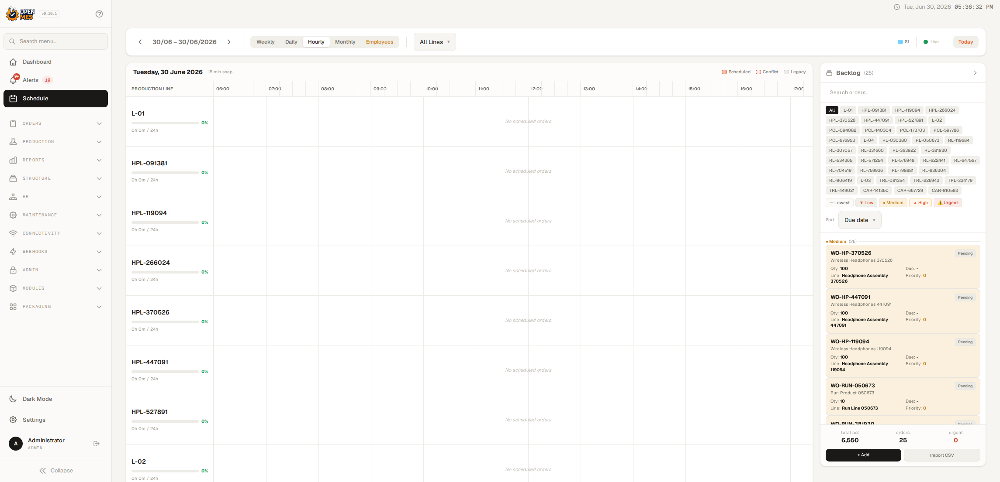
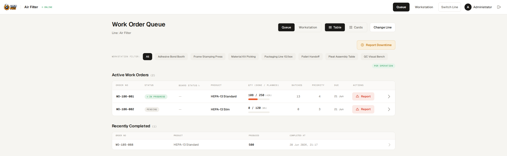
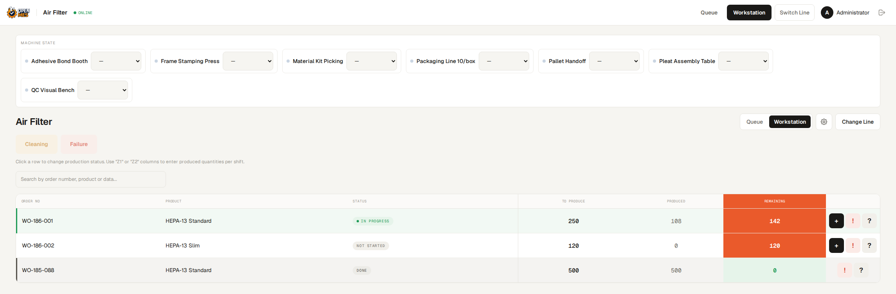

<div align="center">

# OpenMES

### Open-Source Manufacturing Execution System

*Powerful, flexible, and tablet-ready MES for small manufacturers*

[](https://www.gnu.org/licenses/agpl-3.0)
[](https://laravel.com)
[](https://livewire.laravel.com)
[](https://www.postgresql.org)
[](./docs/isa95.md)

**🚀 [Try the live demo → demo-2.getopenmes.com](https://demo.getopenmes.com/register)**
*Free demo account — active for 3 hours, no credit card required*

[](https://discord.gg/fw3fG78pZj)


</div>

---

## What is OpenMES?

**OpenMES** is a modern, open-source Manufacturing Execution System designed specifically for **small manufacturers** (woodworking, metalworking, assembly shops) who need powerful production tracking without enterprise complexity.



### Why OpenMES?

- 🎯 **Purpose-built for small manufacturers** - No bloat, just what you need
- 📱 **Tablet-first design** - Touch-optimized for shop floor operators
- 🔒 **Security-first** - OWASP Top 10 compliant from day one
- 📊 **Real-time visibility** - Know exactly what's happening on every line
- 🆓 **Truly open-source** - AGPL-3.0 licensed, no vendor lock-in
- 🚀 **Deploy in minutes** - Single command Docker deployment
- 📐 **ISA-95 aligned** — Level 3 MES with ISA-95 / IEC 62264 hierarchies and MOM coverage ([details](./docs/isa95.md))

---

## Features

### Production Planner

Drag-and-drop production scheduling with Gantt-style views across multiple production lines.



- **Weekly / Daily / Hourly / Monthly views** — switch between planning horizons
- **Drag & drop scheduling** — assign and move work orders across lines and shifts
- **Hourly Gantt view** — minute-level precision with resize and cross-line moves
- **Real-time polling** — live updates when changes happen on the shop floor
- **Backlog panel** — unassigned orders with priority filtering and search
- **Overdue alerts** — visual flagging of overdue orders on the timeline



### Production Management

- **Multi-line production** - Manage multiple production lines simultaneously
- **Work order tracking** - Complete work order lifecycle management
- **Batch production** - Support partial completion with multiple batches
- **Process templates** - Reusable, step-by-step process definitions
- **CSV Import** - Bulk import work orders with flexible column mapping
- **Real-time status** - Live production status updates

### Operator Experience





- **Step-by-step guidance** - Clear instructions for every operation
- **Sequential workflow** - Enforce process order to prevent mistakes
- **One-tap actions** - Start, complete, report issues with single tap
- **PWA support** - Install on tablets, works offline
- **Offline mode** - Queue actions when network is unavailable
- **Tablet-optimized** - Large touch targets (48px+), minimal text input

### Issue & Andon System

- **Problem reporting** - Operators report issues instantly from any step
- **Automatic blocking** - Critical issues halt production automatically
- **Issue escalation** - Route problems to supervisors with notifications
- **Resolution tracking** - Complete issue lifecycle (Open → Acknowledged → Resolved → Closed)
- **Predefined categories** - Material shortage, quality issues, tool failures, etc.

### Analytics & Reporting

- **Supervisor Dashboard** - Real-time KPIs and production metrics
- **Interactive Charts** - Throughput, cycle time, issue trends, step performance
- **Production Reports** - Summary, batch completion, downtime reports
- **CSV Export** - Export all reports for further analysis
- **Traceability** - Complete audit trail for every action

### Security & Compliance

- **Immutable audit logs** - PostgreSQL-enforced, cannot be altered
- **Complete traceability** - Track every action, user, and timestamp
- **Role-based access** - Admin, Supervisor, Operator roles
- **Line-based filtering** - Operators only see assigned lines
- **Compliance-ready** - ISO 9001, AS9100 compatible audit trail

---

## Extensibility & Modules

OpenMES is built to be extended! Use our comprehensive **hook system** to add custom functionality without modifying core code.

### Hook System

- **40+ events** covering the entire production lifecycle
- **Work Order hooks** - Created, Updated, Completed, Blocked
- **Batch hooks** - Created, Completed, Cancelled
- **Step hooks** - Started, Completed, Problem Reported
- **User hooks** - Assigned to Line, Created, Updated
- **Line hooks** - Created, Activated, Deactivated
- **Process Template hooks** - Template & Step management
- **CSV Import hooks** - Started, Completed, Failed

### Create Custom Modules

```php
// Listen to work order completion
Event::listen(WorkOrderCompleted::class, function ($event) {
    // Send notification to ERP system
    ExternalAPI::notifyCompletion($event->workOrder);

    // Update inventory
    Inventory::increment($event->workOrder->product_type_id);

    // Send email to warehouse
    Mail::to('warehouse@company.com')->send(/* ... */);
});
```

### Example Use Cases

- **ERP Integration** - Sync with SAP, Odoo, or custom systems
- **Custom Notifications** - Email, SMS, Slack, Teams
- **Quality Control** - Automated inspections and checks
- **IoT Integration** - Connect machines and sensors
- **Custom Reports** - Generate PDFs, Excel, or API exports
- **Inventory Management** - Auto-update stock levels
- **Barcode/RFID** - Track materials and products

📚 **Full Documentation**: [HOOKS.md](HOOKS.md)
📁 **Module Examples**: [modules/](modules/)

---

## 📦 Built-in Modules

OpenMES ships with optional modules that can be enabled from **Admin → Modules**.

### Packaging — EAN Barcode Scanning Station

Dedicated station for scanning finished products with a barcode reader (EAN/QR) before shipping or warehouse handoff.

**How it works:**

1. Operator opens `/packaging/station` on a dedicated workstation or tablet
2. Scans an EAN barcode with a USB/Bluetooth reader (or types it manually)
3. The system looks up which work order the EAN belongs to and increments its `packed_qty` counter
4. Live stats update every 3 seconds: packed today, plan, backlog, realisation %

**Features:**

- **EAN management** — assign one or multiple EAN codes to any work order (`Admin → Packaging → EAN Codes`)
- **Scan history** — every scan is logged with timestamp, user, and result (success / unknown EAN / error)
- **Shift-based counters** — `packed_qty` resets each shift; shift boundaries are configurable
- **Manual reset** — `php artisan packaging:reset-shift` resets all counters immediately
- **Admin dashboard** — read-only overview of all lines with the same live stats as the operator view

**Routes:**

| URL | Access | Description |
|---|---|---|
| `/packaging/station` | Operator, Supervisor, Admin | Scanning station |
| `/packaging/` | Supervisor, Admin | Admin overview |
| `/packaging/eans` | Supervisor, Admin | EAN code management |

**Required migrations** (run automatically on first deploy):

```
create_work_order_eans_table
create_packaging_scan_logs_table
add_packed_qty_to_work_orders_table
```

---

## Architecture

OpenMES uses a **dead-simple** Laravel monolith architecture:

```
┌─────────────────┐
│  Laravel App    │  :80 (serves everything)
│  (Blade + API)  │
└────────┬────────┘
         │
    ┌────▼─────┐
    │ PostgreSQL│
    └──────────┘
```

**Stack:**
- **Backend**: Laravel 12 with Blade templates
- **Frontend**: Tailwind CSS 4 + Alpine.js for interactivity
- **Real-time**: Livewire 4 for dynamic components
- **Charts**: Chart.js for analytics
- **Database**: PostgreSQL 17+ with immutable audit logs
- **Deployment**: Docker Compose (2 containers only!)

### Why This Architecture?

- **Ultra Simple**: Just 2 containers (Laravel + PostgreSQL)
- **One-Command Install**: clone, run installer, done
- **No Reverse Proxy**: Laravel serves directly on port 80
- **Easy Maintenance**: Single codebase, traditional Laravel patterns
- **LAN Optimized**: Server-rendered pages, perfect for local networks
- **Mobile Ready**: Responsive Blade templates work on tablets
- **Fast**: Built-in assets compilation with Vite

### ISA-95 Compatibility

OpenMES architecture maps onto the ISA-95 / IEC 62264 standard for Manufacturing Operations Management at Level 3. See [docs/isa95.md](./docs/isa95.md) for the full coverage matrix across Production, Maintenance, Quality, and Inventory operations.

---

## 🚀 Installation

### Prerequisites

- Docker & Docker Compose (20.10+)
- Git

### Installation 🎯

**One command — clone and run the installer:**

```bash
git clone https://github.com/Mes-Open/OpenMes.git
cd OpenMes
./install.sh
```

`install.sh` generates secure credentials into `.env`, **auto-selects a free host port** (80 if it's available, otherwise the next free one — e.g. 8080), builds the app from the cloned source, and starts it in **production**. When it finishes it prints your URL and admin login. Use `./install.sh --yes` to accept all defaults non-interactively.

**Windows?** In **PowerShell** (Docker Desktop) run the equivalent installer — same behaviour as `install.sh`:

```powershell
.\install.ps1
```

(Under WSL2 just use `./install.sh`.)

**Prefer plain Compose?** `docker compose up -d --build` also works — it builds from source and serves on port 80 (override with `HTTP_PORT`/`HTTPS_PORT` in `.env` if 80 is taken).

### First boot

With Docker, the database is migrated and the admin account is created
automatically on first boot (from the credentials in `.env`) — no manual wizard
step is needed. Open the URL the installer printed and log in.

> Running OpenMES outside Docker (bare PHP)? A web-based setup wizard guides you
> through database and admin configuration the first time you open the site.

### First Steps After Installation

1. **Login** with your admin credentials
2. **Create production lines** in the admin panel
3. **Add users** (operators, supervisors) and assign them to lines
4. **Import work orders** via CSV or create manually
5. **Install PWA on tablets** for offline support

### Troubleshooting

**Containers not starting?**
```bash
# Check container logs
docker-compose logs backend
docker-compose logs postgres

# Restart containers
docker-compose restart

# Rebuild containers (if needed)
docker-compose down
docker-compose build --no-cache
docker-compose up -d
```

**Database connection errors?**
```bash
# Make sure postgres is healthy
docker-compose ps

# Check database credentials
grep DB_PASSWORD .env backend/.env

# Restart backend
docker-compose restart backend
```

**Application not loading?**
```bash
# Check if services are running
docker-compose ps

# View backend logs
docker-compose logs -f backend

# Rebuild backend (includes asset build)
docker-compose build --no-cache backend
docker-compose up -d
```

**Port 80 already in use?**
```bash
# Check what's using port 80
sudo lsof -i :80

# Edit docker-compose.yml to use different port:
# Change: - "80:8000" to "8080:8000"
# Then access at: http://localhost:8080
```

---

## 📱 PWA Installation (Tablets)

### iOS (iPad)
1. Open Safari and navigate to OpenMES
2. Tap the Share button
3. Select "Add to Home Screen"
4. Name it "OpenMES" and tap Add
5. Launch from home screen

### Android (Tablets)
1. Open Chrome and navigate to OpenMES
2. Tap the menu (⋮)
3. Select "Install app" or "Add to Home Screen"
4. Confirm installation
5. Launch from home screen

**Benefits:**
- Full-screen mode (no browser chrome)
- Works offline with automatic sync
- Native app-like experience
- Touch-optimized for manufacturing floor

---

## 📚 Documentation

- [User Guides](docs/) - Operator, Supervisor, and Admin guides
- [API Documentation](docs/API_DOCUMENTATION.md) - REST API reference
- [PWA Testing Guide](docs/pwa-testing-guide.md) - Offline functionality testing
- [Technical Documentation](docs/development.md) - For developers
- [MQTT Connectivity Testing](docs/mqtt-connectivity.md) - Machine connection testing guide

---

## 🤝 Contributing

We welcome contributions! Whether it's bug reports, feature requests, documentation, or code - we'd love your help.

1. Fork the repository
2. Create a feature branch
3. Make your changes
4. Run tests
5. Submit a pull request

See [CONTRIBUTING.md](docs/CONTRIBUTING.md) for details.

---

## Working on the React frontend

OpenMES is incrementally adopting **React via [Inertia.js](https://inertiajs.com/)** alongside the existing Blade + Livewire UI. Both render trees coexist — new pages can opt into React without touching anything else.

### Live-edit workflow (no local Node install required)

The point of this setup: pull the repo, drop it on a server (FTP/SSH/whatever), edit `.jsx` files in place, refresh the browser. No `npm install` on your laptop, no build step in your hands. A container handles it.

Start the stack with the dev overlay:

```bash
docker compose -f docker-compose.yml -f docker-compose.dev.yml up -d
```

That overlay (`docker-compose.dev.yml`):

- Spins up a `frontend` container running `vite build --watch`. It watches `backend/resources/` and rebuilds `backend/public/build/` in ~100ms whenever you save a file.
- Bind-mounts the application source (`app/`, `routes/`, `resources/`, `public/`, …) into the backend container so PHP/Blade edits are live too.

Workflow:

1. Edit `backend/resources/js/Pages/Foo.jsx` (or any source file).
2. The watcher rebuilds automatically — check `docker compose logs -f frontend` if you want to see it.
3. Refresh the browser.

### Adding a new React page

1. Create the page component at `backend/resources/js/Pages/Foo.jsx`:

   ```jsx
   import { Head } from '@inertiajs/react';

   export default function Foo({ greeting }) {
       return (
           <>
               <Head title="Foo" />
               <h1>{greeting}</h1>
           </>
       );
   }
   ```

2. Add a route in `backend/routes/web.php`:

   ```php
   Route::get('/foo', fn () => Inertia::render('Foo', [
       'greeting' => 'Hello from Laravel',
   ]));
   ```

3. Visit `/foo`. Props from the controller arrive as React props.

### Production builds

Production deployments do not use `docker-compose.dev.yml`. The image's `Dockerfile` already runs `npm ci && npm run build` at image build time, so the production container ships with pre-built assets — no Node process at runtime.

---

## Live data sync (Electric SQL)

OpenMES uses [**Electric SQL**](https://electric-sql.com) for read-path live sync between Postgres and React/mobile clients. Instead of broadcasting events from Laravel and reconciling state on the client, clients **subscribe to a named shape** (a server-defined query) and Electric pushes changes from Postgres's WAL automatically. Writes still go through Laravel controllers as before.

### Architecture — gatekeeper, not proxy

Laravel **authorizes** a shape once and hands back a signed capability; the browser then streams from Electric **through Caddy**. PHP never holds the long-poll.

```
1. authorize:   client ─► GET /api/shapes/{name} (Laravel gatekeeper, authed)
                          ◄─ { url, params: { table, columns, where, exp, sig } }   (HMAC-signed)

2. stream:      client ─► /electric/* (Caddy) ──forward_auth──► /api/electric/authorize  (fast HMAC check)
                                       └──reverse_proxy──► Electric ─► Postgres WAL
                          ◄─ live shape updates via useShape()

   writes:      client ─► Laravel controllers (validation, auth, Eloquent events) ─► Postgres
```

- **Electric** runs as a sidecar container, talks to Postgres over logical replication.
- **Laravel** owns the shape registry (`app/Sync/Shapes/`) and the gatekeeper (`app/Http/Controllers/Api/ShapeGatekeeperController.php`): `config()` issues the signed shape, `verify()` is Caddy's `forward_auth` target. Clients request shapes by name, never by table.
- **Caddy** (`/electric/*` route) holds the ~20s long-polls and proxies them to Electric. Crucially, **the long-poll never occupies a PHP worker** — PHP only does the fast signature check per poll. This is what lets the stack scale to many concurrent live clients.
- **Clients** (React via `@electric-sql/react`, future mobile via `@electric-sql/client`) fetch the signed config, then stream from `/electric/*`.

> **Why a gatekeeper and not a straight proxy?** An earlier design proxied Electric's `live=true` long-poll *through* PHP. Because the dev server is single-threaded, one held long-poll froze the whole app (login 20s→90s+). Long-polls must be held by Caddy/Electric, never PHP.

### Prerequisites

Postgres must run with **logical replication** enabled. The base `docker-compose.yml` already passes the required flags:

```yaml
command:
  - postgres
  - -c
  - wal_level=logical
  - -c
  - max_replication_slots=10
  - -c
  - max_wal_senders=10
```

If you're connecting to a managed Postgres (RDS, Supabase, Neon, etc.), enable logical replication in the provider's console.

### Adding a new shape

Three files:

1. **Define the shape.** `backend/app/Sync/Shapes/MyShape.php`:

   ```php
   class MyShape extends Shape {
       public function table(): string { return 'my_table'; }
       public function columns(): array { return ['id', 'name', 'status']; }
       public function where(User $user): ?string {
           return "tenant_id = {$user->tenant_id}";
       }
   }
   ```

2. **Register it.** Add to the `$shapes` map in `backend/app/Sync/ShapeRegistry.php`:

   ```php
   'my_shape_name' => MyShape::class,
   ```

3. **Subscribe from React.** Fetch the signed config, then stream it (see `lib/useShapeConfigs.js` + `lib/useDashboardShapes.js` for the shared pattern):

   ```jsx
   // 1. authorize (quick, authenticated)
   const cfg = await fetch('/api/shapes/my_shape_name', {
       headers: { Authorization: `Bearer ${token}`, Accept: 'application/json' },
   }).then((r) => r.json());

   // 2. stream from Electric via Caddy (absolute url required by the client)
   const { data } = useShape({ ...cfg, url: window.location.origin + cfg.url });
   ```

See `Pages/ElectricTest.jsx` and the `/electric-test` route for a working example.

### Security model

- Clients **cannot pick the table** — they pick a shape name. Adding a new shape is a deliberate code change.
- Clients **cannot pick which columns** to read — the shape's `columns()` method is the whitelist. Sensitive columns (password hashes, tokens, PII) simply aren't listed.
- Clients **cannot escape the server WHERE** — the HMAC signature covers `table`, `columns`, and the server-built `where`, so any tampering (widening scope, swapping the table, reading other columns) fails `verify()` with a 403 at the Caddy edge.
- The gatekeeper `config()` requires authentication (`auth:web,sanctum`). The signed capability expires (`exp`), bounding the leak window.

### Operational notes

- **Replication slot lag.** Electric maintains a Postgres replication slot called `electric_slot_default`. If Electric is down for an extended period, WAL accumulates on the Postgres volume. Monitor with:
  ```sql
  SELECT slot_name, pg_size_pretty(pg_wal_lsn_diff(pg_current_wal_lsn(), restart_lsn)) AS lag
  FROM pg_replication_slots;
  ```
- **Removing Electric.** Drop the slot first or Postgres will keep retaining WAL forever:
  ```sql
  SELECT pg_drop_replication_slot('electric_slot_default');
  ```
- **App-server runtime.** The backend serves via **Laravel Octane on RoadRunner** (`octane:start` is the Dockerfile `CMD`) — a concurrent, in-memory runtime. The old `php artisan serve` was single-threaded and serialized every request; it remains only as a documented dev fallback. Octane keeps the framework booted between requests, so watch for state that assumes a fresh boot per request (singletons, static props) — validate the full app under Octane before a production rollout.
- **Signature expiry.** Issued shape capabilities carry a 1-hour `exp`. A dashboard left open past that will start getting 403s on poll; the client needs to re-fetch config from the gatekeeper on expiry (a refresh-on-403 hook — not yet wired in this PoC).
- **Production auth.** The `/electric-test` and `/admin/dashboard` routes use a short-lived Sanctum token passed as an Inertia prop to authorize the gatekeeper `config()` calls. Real pages should use Sanctum's [SPA stateful (cookie) mode](https://laravel.com/docs/sanctum#spa-authentication) — no tokens, just the session cookie.
- **Widget registry regression.** The Blade dashboard supported a `WidgetRegistry` extension API where modules registered Blade views into named zones (`admin_dashboard.kpi`, `admin_dashboard.main`, `admin_dashboard.sidebar`). The React/Electric dashboard does **not** render these. No bundled module currently uses the registry, so nothing actively breaks — but a future React-based widget extension API needs to be designed before third-party modules can extend the new dashboard.

---

## 📄 License

OpenMES is open-source software licensed under the **GNU Affero General Public License v3.0 (AGPL-3.0)**.

This means you can:
- ✅ Use it commercially
- ✅ Modify it
- ✅ Distribute it
- ✅ Use it privately

Under the following conditions:
- 📋 Disclose source — distributing or running a modified version over a network requires making the corresponding source available under the same license
- 📋 Same license — derivative works must also be licensed under AGPL-3.0
- 📋 State changes — document significant modifications

See [LICENSE](LICENSE) for full details.

---

## 📞 Support

### Free Support
- 📖 Read the [documentation](docs/)
- 🔍 Search [existing issues](https://github.com/Mes-Open/OpenMes/issues)
- 💬 Ask in [discussions](https://github.com/Mes-Open/OpenMes/discussions)

### Commercial Support
Need help with deployment, customization, or training?
Contact us at **jakub.przepioraa@gmail.com**

---

<div align="center">

**Built with ❤️ for the manufacturing community**

Made by manufacturers, for manufacturers

⭐ If you find OpenMES useful, please give it a star!

</div>
